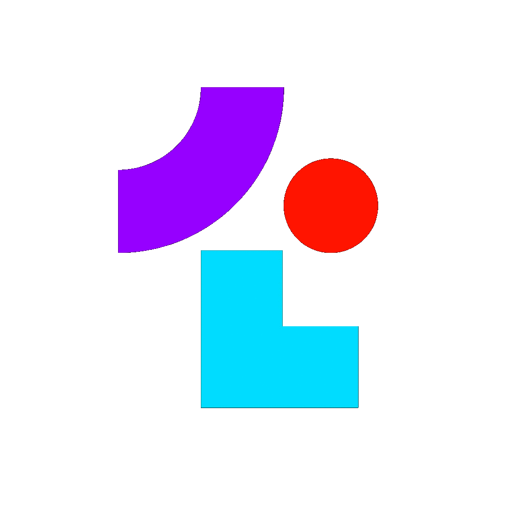

<div align="center">
  <h3>
    
    </br>
    Blurring the Language Lines
  </h3>

  <div align="center">
    <!-- Ubuntu CICD pipeline -->
    <a href="https://github.com/Tolc-Software/tolc/actions/workflows/ubuntu.yml">
      
    </a>
    <!-- MacOS CICD pipeline -->
    <a href="https://github.com/Tolc-Software/tolc/actions/workflows/macos.yml">
      
    </a>
    <!-- MacOS CICD pipeline -->
    <a href="https://github.com/Tolc-Software/tolc/actions/workflows/windows.yml">
      
    </a>
  </div>

  <div align="center">
    <!-- docs -->
    <a href="https://docs.tolc.io/">
      
    </a>
    <!-- Discord -->
    <a href="https://discord.gg/NwDxCGztjN">
      
    </a>
  </div>


  <div align="center">
    <h3>
      <a href="https://tolc.io/"> Website </a>
      <span> | </span>
      <a href="https://docs.tolc.io/"> Getting Started </a>
      <span> | </span>
      <a href="https://tolc.io/live"> Try Online </a>
    </h3>
  </div>
</div>

`Tolc` aims to make it trivial to use `C++` from other languages. It does not require you to change any code, and it's integrable in any project. Make `C++` libraries feel natural to use in any language!

### Design goals: ###

* **No, or minimal overhead** - You are using `C++` for a reason
* **Cross platform/compiler** - Works in the same way on Linux, MacOS, and Windows, across compilers
* **No vendor-lockin** - Generated bindings are readable, start writing them manually at any time

## Usage ##

`Tolc` provides easy to use abstractions to create a bindings library directly from `CMake`:

```cmake
tolc_create_bindings(
  TARGET MyLib
  LANGUAGE python
  OUTPUT ${CMAKE_CURRENT_BINARY_DIR}/python-bindings
)
```

This will extract the public API from the target `MyLib`, give it to `Tolc` to create bindings, and expose it to `CMake` as the target `MyLib_python`. To see all options available for `tolc_create_bindings`, please see the [the documentation](https://docs.tolc.io/cmake/reference/).

In this example you will find the built `CPython` library under `<build_directory>/tolc`, so you can use it straight away with:

```shell
$ cd build/tolc
$ python3
>>> import MyLib
>>> MyLib.myCppFunction()
```

## Installing ##

The prebuilt binaries are available under [the releases tab](https://github.com/Tolc-Software/tolc/releases/tag/main-release) in this repository. You may simply install them directly from there, or use `CMake` to download the binary for your platform directly:

```cmake
# Can be ["latest", "v0.2.0", ...]
set(tolc_version latest)
include(FetchContent)
FetchContent_Declare(
  tolc_entry
  URL https://github.com/Tolc-Software/tolc/releases/download/${tolc_version}/tolc-${CMAKE_HOST_SYSTEM_NAME}.tar.xz
)
FetchContent_Populate(tolc_entry)

find_package(
  tolc
  CONFIG
  PATHS
  ${tolc_entry_SOURCE_DIR}
  REQUIRED
)
```

This will download the `Tolc` binary locally for Linux, MacOS, or Windows, depending on the expansion of `${CMAKE_HOST_SYSTEM_NAME}`. After the call to `find_package`, you can use any `CMake` function provided by `Tolc`.

## Building ##

`Tolc` can be built on Linux, MacOS, and Windows. See the [CI pipelines for more platform specific information](./.github/workflows/).

Here is a general overview:

Requirements:

* CMake
* python3
* conan
* clang

Configure the project:

```shell
$ cmake -S. -Bbuild -G Ninja -DCMAKE_CXX_COMPILER="clang++" -DCMAKE_C_COMPILER="clang" -DCMAKE_BUILD_TYPE="Debug" -DENABLE_TESTING=ON -DENABLE_PACKAGING=ON
```

Build `tolc`:

```shell
cmake --build build
```

Test with `ctest`:

```shell
cd build
ctest
```

Create install package with `CPack`:

```shell
$ cpack -G TGZ --config build/CPackConfig.cmake
```

This repository holds the command line interface for `tolc`, see [the Parser](https://github.com/Tolc-Software/Parser) for how the `C++` to be translated is parsed, or [one of the language modules](https://github.com/Tolc-Software/frontend.py) to see how the output is written.

