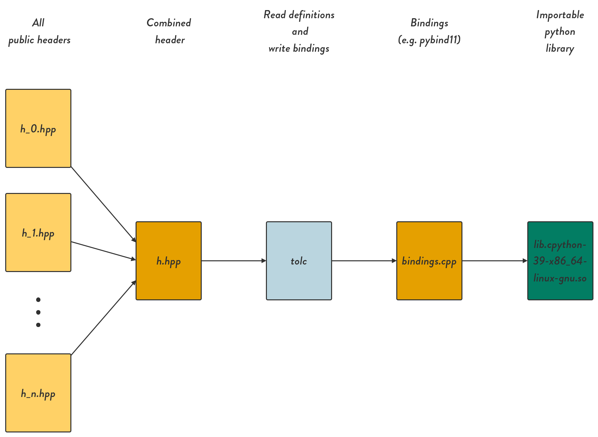

# Usage

Given that you have installed `tolc`, either via the [bootstrapper](https://github.com/Tolc-Software/bootstrap-tolc-cmake), or by downloading the package from the [release page](https://github.com/Tolc-Software/tolc-beta/releases/tag/beta-release), you should be able to use the `CMake` interface.
## Via `CMake`

### `tolc_create_translation`

Example usage:

```CMake
tolc_create_translation(
  TARGET MyLib
  LANGUAGE python
  OUTPUT ${CMAKE_CURRENT_BINARY_DIR}/python-bindings
)
```

This will create a new target called `MyLib_python` which, when built and available, will be importable from `python` as `import MyLib`. The generated `python` library will be available under `${CMAKE_CURRENT_BINARY_DIR}/tolc`, typically `build/tolc`. To import it, start a `python` session from the same directory as the built library and import it as you would any other library.

An overview of the internal process is described below:

1. Find and combine all public header files based on include directories marked `PUBLIC` in `CMake` for target `MyLib`.
2. Let `tolc` read the combined header and generate the bindings (in this case they will be available under `${CMAKE_CURRENT_BINARY_DIR}/python-bindings`).
3. Download and make [`pybind11`](https://github.com/pybind/pybind11) available.
4. Create the target `MyLib_python` and link it to `pybind11` aswell as `MyLib`.



